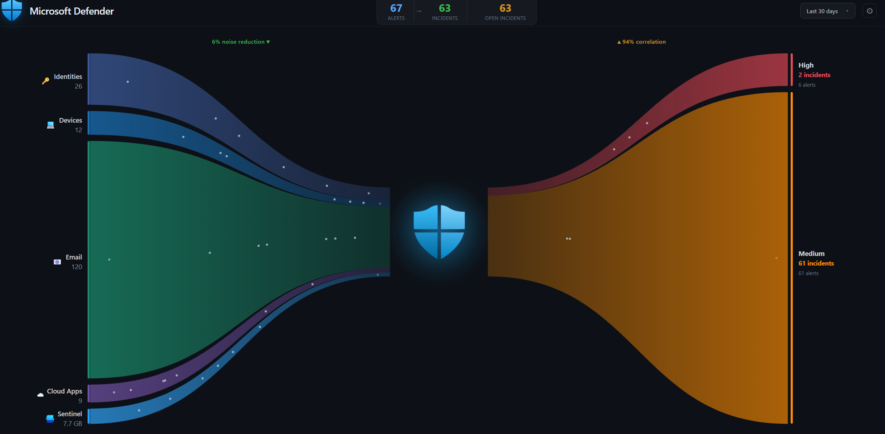

# Microsoft Defender Dashboard

A real-time Sankey-style dashboard for Microsoft Defender, visualizing security signals flowing from data sources into correlated incidents.



## Features

- **Sankey Flow Visualization** — Animated particle flows from data sources through the Defender shield to incident severities
- **Live Data via KQL** — All data fetched using Microsoft Graph Security `runHuntingQuery` API
- **Auto Refresh** — Configurable auto-refresh interval (30s, 1min, 5min, 10min, 30min)
- **Time Frame Selection** — Filter data from 1 hour to 30 days
- **Managed Identity Auth** — Secure authentication via Azure App Service Managed Identity (no secrets stored)
- **Zero-Fallback** — Gracefully displays zeros if API is unreachable
- **Loading Animation** — Smooth loading screen with fade-in dashboard reveal

## Data Sources (Left Side)

| Source | KQL Table | Description |
|--------|-----------|-------------|
| Identities | `IdentityInfo` | Distinct user accounts |
| Devices | `DeviceInfo` | Distinct devices seen |
| Email | `EmailEvents` | Email event count |
| Cloud Apps | `CloudAppEvents` | Distinct cloud applications |
| Sentinel | `Usage` | Log ingestion volume (GB) |
| AI Agent | `AIAgentsInfo` | Distinct AI agents |

## Incident Severities (Right Side)

| Severity | Color |
|----------|-------|
| High | 🔴 Red |
| Medium | 🟠 Orange |
| Low | 🟡 Yellow |
| Informational | 🔵 Blue |

## Prerequisites

- **Azure Subscription** with an App Service
- **Microsoft Defender** / **Microsoft Sentinel** configured in your tenant
- **Microsoft Graph API** permission: `ThreatHunting.Read.All` (Application)

## Project Structure

```
defender-dashboard/
├── package.json         # Node.js dependencies (Express, @azure/identity)
├── server.js            # Backend API — KQL queries via Graph Security API
├── public/
│   └── index.html       # Frontend — Sankey dashboard with SVG + CSS + JS
├── DEPLOY-GUIDE.md      # Step-by-step deployment instructions
└── README.md
```

## Quick Start

### Local Development

```bash
# Clone the repo
git clone https://github.com/YinonGindi/DefenderDashboard.git
cd DefenderDashboard

# Install dependencies
npm install

# Run (uses Azure CLI credentials locally)
npm start
```

Open `http://localhost:8080`

### Deploy with ARM Template

[](https://portal.azure.com/#create/Microsoft.Template/uri/https%3A%2F%2Fraw.githubusercontent.com%2FYinonGindi%2FDefenderDashboard%2Fmain%2Fazuredeploy.json)

Or via Azure CLI:

```bash
az deployment group create \
  --resource-group YOUR_RESOURCE_GROUP \
  --template-file azuredeploy.json \
  --parameters appName=defender-dashboard-yourname
```

The template creates:
- **App Service Plan** (Linux, B1 tier by default)
- **App Service** with Node 20, System-Assigned Managed Identity, HTTPS-only
- Outputs the **Managed Identity Object ID** and the **Cloud Shell command** to grant `ThreatHunting.Read.All`

After deployment, ZIP deploy your code and run the permission grant command from the outputs.

### Manual Deployment

See [DEPLOY-GUIDE.md](DEPLOY-GUIDE.md) for a detailed step-by-step guide.

**TL;DR:**
1. Create a **Node 20 LTS Linux** App Service
2. Enable **System-Assigned Managed Identity**
3. Grant **`ThreatHunting.Read.All`** to the Managed Identity
4. Set app setting: `SCM_DO_BUILD_DURING_DEPLOYMENT` = `true`
5. ZIP deploy `package.json`, `server.js`, and `public/`
6. Set startup command: `node server.js`

## API

### `GET /api/dashboard?timeframe=24h`

Returns all dashboard data in a single JSON response.

**Timeframe values:** `1h`, `4h`, `12h`, `24h`, `3d`, `7d`, `30d`

**Response:**
```json
{
  "sources": { "identities": 150, "devices": 200, "email": 5000, "cloudApps": 45, "sentinelGB": 4.7, "aiAgents": 12 },
  "header": { "totalAlerts": 342, "totalIncidents": 28, "openIncidents": 5 },
  "stats": { "noiseReduction": 92, "correlation": 8 },
  "incidents": {
    "high": { "incidents": 3, "alerts": 45 },
    "medium": { "incidents": 10, "alerts": 120 },
    "low": { "incidents": 8, "alerts": 95 },
    "informational": { "incidents": 7, "alerts": 82 }
  }
}
```

## Tech Stack

- **Backend:** Node.js + Express
- **Auth:** `@azure/identity` (DefaultAzureCredential / Managed Identity)
- **API:** Microsoft Graph Security — `runHuntingQuery`
- **Frontend:** Vanilla HTML/CSS/JS with SVG Sankey visualization
- **Hosting:** Azure App Service (Linux)

## Metrics Calculation

### Noise Reduction %

```
Noise Reduction = (1 - totalIncidents / totalAlerts) × 100
```

Represents the percentage of alerts that were **reduced** and not escalated into incidents.  
Example: 342 alerts → 28 incidents = **92% noise reduction**

### Correlation %

```
Correlation = (totalIncidents / totalAlerts) × 100
```

Represents the percentage of alerts that **correlated** into actual incidents.  
Example: 28 incidents / 342 alerts = **8% correlation**

> Noise Reduction + Correlation = 100%. If there are 0 alerts, both display 0%.

## License

MIT
